**Терехов Никита** 

**ПИ20-4**

**Лабораторная работа "Многопоточный сервер" по Практикуму по программированию**

**Задания для самостоятельного выполнения**

1. Модифицировать простой эхо-сервер таким образом, чтобы при подключении клиента создавался новый поток, в котором происходило взаимодействие с ним.

Данный функционал можно увидеть в п. 3, когда к многопоточному серверу одновременно смогут подлючиться несколько пользователей, следовательно, взаимодействие с каждым происходит в новом потоке.

2. Реализовать простой чат сервер на базе сервера аутентификации. Сервер должен обеспечивать подключение многих пользователей одновременно, отслеживание имен пользователей, поддерживать историю сообщений и пересылку сообщений от каждого пользователя всем остальным.

Сервер: 

Клиент 1 (регистрация): 

Клиент 2 (регистрация): 

Клиент 1: 

Клиент 2: 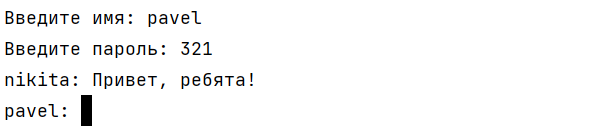

Клиент 2: 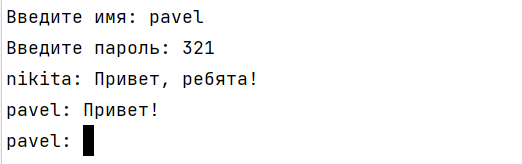

Клиент 1: 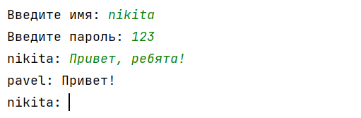

Клиент 2 (выходит): 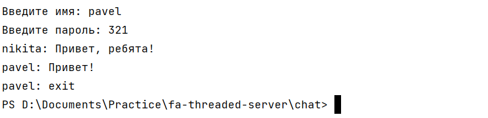

Клиент 2 (вход, неверный пароль): 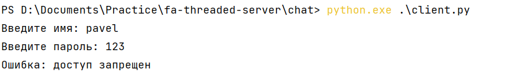

Клиент 2 (вход): 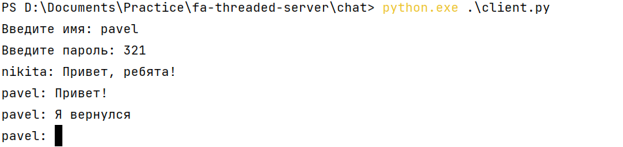

Клиент 1: 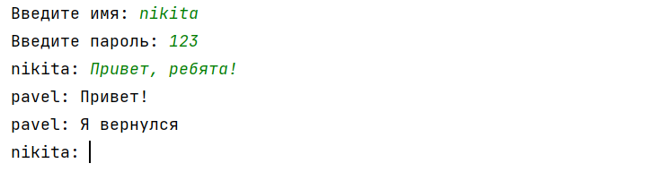

3. Реализовать сервер с управляющим потоком. При создании сервера прослушивание портов происходит в отдельном потоке, а главный поток программы в это время способен принимать команды от пользователя. Необходимо реализовать следующие команды:

Сервер (ввод не существующей команды): 

Клиент: 

\1. Отключение сервера (завершение программы);

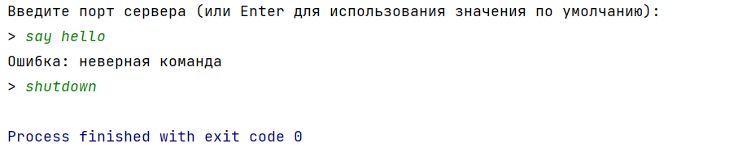

\2. Пауза (остановка прослушивание порта);

При подключении клиента его не приветсвуют (запрещают взаимодействовать с сервером) до тех пор, пока сервер не будет снят с паузы. 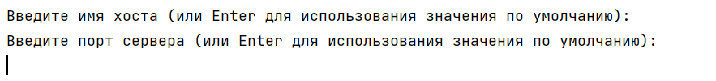

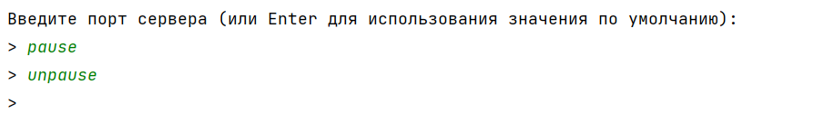

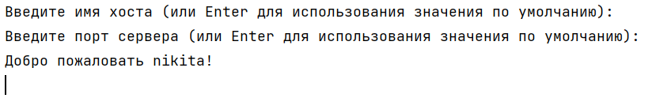

\3. Показ логов;

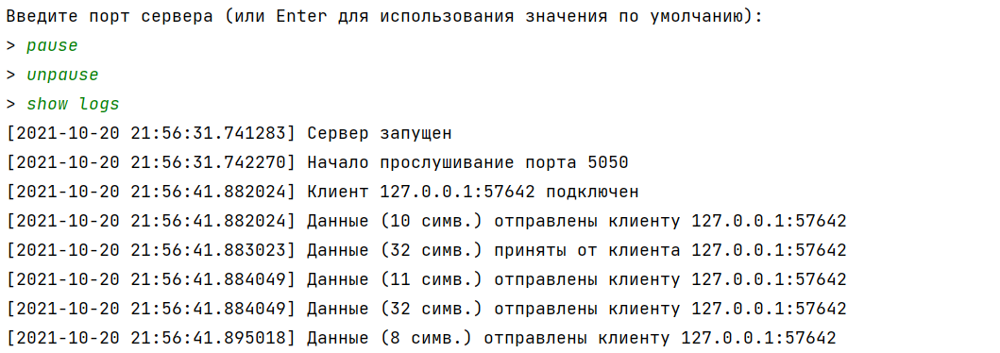

\4. Очистка логов;

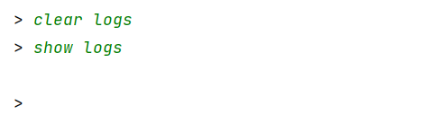

\5. Очистка файла идентификации.

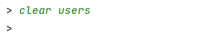

